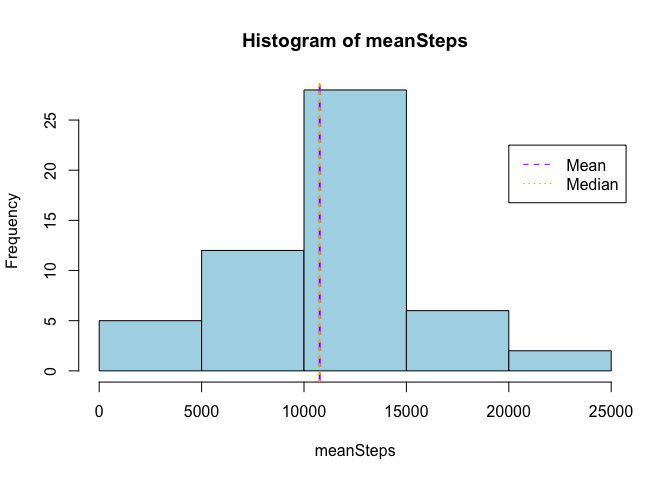
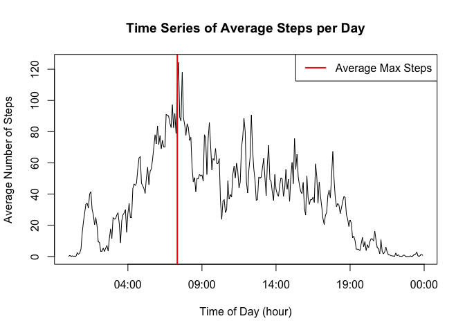
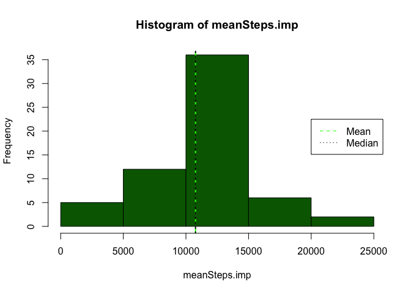
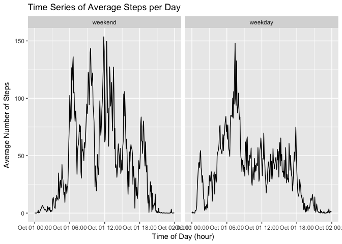

# Peer Assessment 1: Activity Monitor Data Analysis
**Author:** Dylan Pudwill
**Date:** 16.05.2018

## Table of Contents
1. `doc`: rdpeng's instructions pdf file 
2. `instructions_fig`: rdpeng's sample panel plot 
3. `PA1_template.Rmd`: pdpeng's template for the .Rmd file 
4. `README.md`: rdpeng's instructions file..... again... 
5. `activity.zip`: rdpeng included a zip file including all the data 
6. `project1Dylan.Rmd`: my .Rmd file including my analysis!

*Repo Details and Important Info: The repo was cloned from rdpeng and he had a few files in the repo already. I will list all files in the repo including rdpeng's original documents. All of my documents will have `Dylan` in the filename.*


**Project Overview:** This project involves analyzing personal activity data to find trends and informative information about the users.

This data analysis will be organized as follows:

1. Loading and Preprocessing the Data 
2. Finding mean total number of steps taken per day 
3. Researching the average daily activity pattern 
4. Imputing missing values 
5. Finding differences in activity patterns between weekdays and weekends 

##Data
**Data Collection Summary:** The data comes from one personal activity monitoring device like a FitBit, Jawbone Up or Nike Fuelband. The data was collected at 5-minute intervals collected throughout the day for two months(October and November, 2012). 
The data are stored in a `csv` file and there are 17,568 observations with 3 variables overall. 

**Variables:**
1. `steps`: Number of steps taking in a 5-minute interval 
2.`date`: The date on which the measurement was taken in YYYY-MM-DD format 
3. `interval`: Identifier for the 5-minute interval in which measurement was taken

You can download the raw data [here](https://d396qusza40orc.cloudfront.net/repdata%2Fdata%2Factivity.zip)

#Let the Analysis Begin:

## Loading and Preprocessing the Data:
The first step is downloading the neccessary files. Again you can find the data at [this URL](https://d396qusza40orc.cloudfront.net/repdata%2Fdata%2Factivity.zip). 

This `activityMonitoringData.zip` file will include one file: 

* `activity.csv`: A `csv` file including the 3 variables and 17,568 observations of  activity monitoring device data


```r
##loading `missForest` package for imputing data!
if( !("dplyr" %in% installed.packages()) ) {
    install.packages("dplyr")
}
if( !("ggplot2" %in% installed.packages()) ) {
    install.packages("ggplot2")
}
if( !("lubridate" %in% installed.packages()) ) {
    install.packages("lubridate")
}

library(lubridate)
```

```
## Warning: package 'lubridate' was built under R version 3.4.4
```

```
## 
## Attaching package: 'lubridate'
```

```
## The following object is masked from 'package:base':
## 
##     date
```

```r
library(ggplot2)
library(dplyr)
```

```
## 
## Attaching package: 'dplyr'
```

```
## The following objects are masked from 'package:lubridate':
## 
##     intersect, setdiff, union
```

```
## The following objects are masked from 'package:stats':
## 
##     filter, lag
```

```
## The following objects are masked from 'package:base':
## 
##     intersect, setdiff, setequal, union
```

```r
##Downloading file if file "activityMonitoringData.zip" does not exist
dlMeth <- "curl" # sets default for OSX / Linux
url <- "https://d396qusza40orc.cloudfront.net/repdata%2Fdata%2Factivity.zip"
if(substr(Sys.getenv("OS"),1,7) == "Windows") dlMeth <- "wininet"
if(!file.exists("activityMonitoringData.zip")) {
    download.file(url,
                  "activityMonitoringData.zip",  # stores file in R working directory
                  method=dlMeth, # use OS-appropriate method
                  mode="w") # "w" means "write," and is used for text files
}

##unzipping newly downloaded zip file
unzip(zipfile = "activityMonitoringData.zip")

activity <- read.csv("activity.csv", stringsAsFactors = FALSE)
```
*Note: I found this code chunck from one of the TAs in a previous class from the John's Hopkins Data Science Specialization. I would love to give him/her credit, but I have searched and cannot find the forum he/she originally posted in.*


Next, I get to know the data.I run `head(activity)` and find there are some `NA` values.

```r
##analyzing data...
head(activity)
```

```
##   steps       date interval
## 1    NA 2012-10-01        0
## 2    NA 2012-10-01        5
## 3    NA 2012-10-01       10
## 4    NA 2012-10-01       15
## 5    NA 2012-10-01       20
## 6    NA 2012-10-01       25
```


After realizing there are NA values, I would like to know the magnitude involved in this data set.

```r
table(is.na(activity$steps))
```

```
## 
## FALSE  TRUE 
## 15264  2304
```
I find that there are `2304` missing `steps` values.


My next step is checking the classes of the variables. The `date` class is `string` and I want to change it to a `Date` variable

```r
activity$date = as.Date(activity$date)
```

Finally, I must format the `interval` variable because it is totally messed up. After my manipulation the `interval` variable I create a new varialbe `interval_time` that will be of class `POSIXct`.

```r
holder <- 0
for (i in seq_along(activity$interval)) {
    activity$interval[i] = holder
    holder = holder + 5
    if(activity$interval[i] == 1440) {
        activity$interval[i] = activity$interval[i] - 1440
        holder = 0
    }
}
activity$interval_time <- as.POSIXct(60 * activity$interval, 
                                origin = '2012-10-01', 
                                tz = "GMT")
```

 
This concludes my preprocessing of the data.
 

## What is mean total number of steps taken per day?

To find the mean total number of steps taken per day I am going to use `tapply`, but first I must subset the data to remove the `NA` values.

```r
activityNoNA <- activity[!is.na(activity$steps), ]
meanSteps <- tapply(activityNoNA$steps, activityNoNA$date, sum)
```

Now, I want to creat my histogram with the average total steps per day on the x-axis and the y-axis as the frequency. 


```r
##plotting histogram of mean steps found using `tapply`
hist(meanSteps, col = "lightblue")

##vertical lines for mean and median
abline(v = mean(meanSteps), col = "purple", lty=2, lwd=2)
abline(v = median(meanSteps), col = "orange", lty = 3, lwd = 2)

##legend for vertical lines
legend(20000, 22.5, c("Mean", "Median"), col = c("purple", "orange"), lty = 2:3)
```

<!-- -->

*Note: The median of `meanSteps` is `10765` and the mean of `meanSteps` is `10766`* 

## What is the average daily activity pattern?

To create my time series I first must use `tapply` again to find the average of each 5 minute time interval during the 2 month period. 

```r
##finding the average steps for each time interval per day. 
timeSeries <- tapply(activityNoNA$steps, activityNoNA$interval_time, mean)

##plotting unique values of `interval` vs. the values I found using `tapply`
plot(unique(activityNoNA$interval_time), 
     timeSeries, 
     type = "l", 
     xlab = "Time of Day (hour)", 
     ylab = "Average Number of Steps", 
     main = "Time Series of Average Steps per Day")

##plotting a vertical line for the time of day with the most average steps
abline(v = activityNoNA$interval_time[which.max(timeSeries)], 
       col = "red", 
       lwd = 2)

##legend for vertical line
legend("topright", 
       100, 
       "Average Max Steps", 
       col = "red", 
       lty = 1, 
       lwd = 2)
```

<!-- -->

From the plot we can see some detailed information about this individuals normal routine. For example they are most active early in the morning around 7:30 AM. Logically, they are almost completely stagnent for most of the night with a perculular spike around 3:00 AM. That could be something worth looking into in the future. 

This concludes my time series analysis.

## Imputing missing values

Next up is filling in the NA values. As stated above there are 2304 missing `steps` values in the data set. Just for a refresher here it is again:


```r
table(is.na(activity$steps))
```

```
## 
## FALSE  TRUE 
## 15264  2304
```

Now it will be advantagous for my analysis if I can fill in those NA values with approximate values. I will impute my data by adding the average interval for each step observation that is missing. For example if I am missing an observation at an interval of `100` I will enter the interval average I found with the previous `tapply` call at `100` minutes. 


```r
for( i in seq_along(activity$interval)) {
    
    if (is.na(activity$steps[i])) {
        ##filling empty steps observation with average steps from that interval
        activity$steps[i] = timeSeries[(activity$interval[i]/5) + 1]
    }
}

##now making sure there are no more NA values
table(is.na(activity))
```

```
## 
## FALSE 
## 70272
```

Yep! That checks out! The table shows all `FALSE` values meaning there are no more `NA` values in my data set! 

Next step is running my original histogram again and comparing the results. 


```r
meanSteps.imp <- tapply(activity$steps, activity$date, sum)

##plotting histogram of mean steps found using `tapply`
hist(meanSteps.imp, col = "darkgreen")

##vertical lines for mean and median
abline(v = mean(meanSteps.imp), col = "green", lty=2, lwd=2)
abline(v = median(meanSteps.imp), col = "black", lty = 3, lwd = 2)

##legend for vertical lines
legend(20000, 22.5, c("Mean", "Median"), col = c("green", "black"), lty = 2:3)
```

<!-- -->

As you can see the histogram got a little taller at the top of the bell curve, but the median and mean stayed the same. That should make sense because my imputed values were averages. 

## Are there differences in activity patterns between weekdays and weekends?

The last segment of this analysis is to find the differences between weekend and weekday patters. I will first create a new factor variable to split the data into weekdays and weekends. From there I can do a very similar time series analysis as above for both subsets of data grouped by the `weekday` factor.


```r
##a string vector to evaluate the `date` variable against
weekString <- c("Monday", "Tuesday", "Wednesday", "Thursday", "Friday")

##creating a factor variable with `weekday` and `weekend` levels
activity$weekday <- factor((weekdays(activity$date) %in% weekString), 
         levels=c(FALSE, TRUE), labels=c('weekend', 'weekday')) 

##grouping data by weekday factor and then interval_time then mean summary
weekPlot <- activity %>%
    group_by(weekday, interval_time) %>%
    summarise(average = mean(steps))
   
qplot(interval_time, average, data = weekPlot, geom = "line",
      facets = . ~ weekday,
      xlab = "Time of Day (hour)", 
      ylab = "Average Number of Steps", 
      main = "Time Series of Average Steps per Day")
```

<!-- -->


